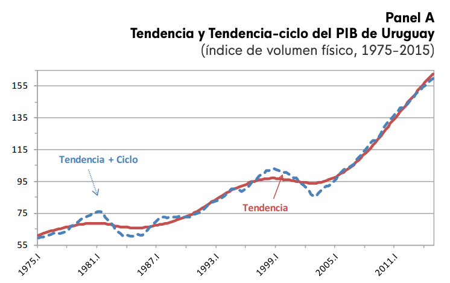
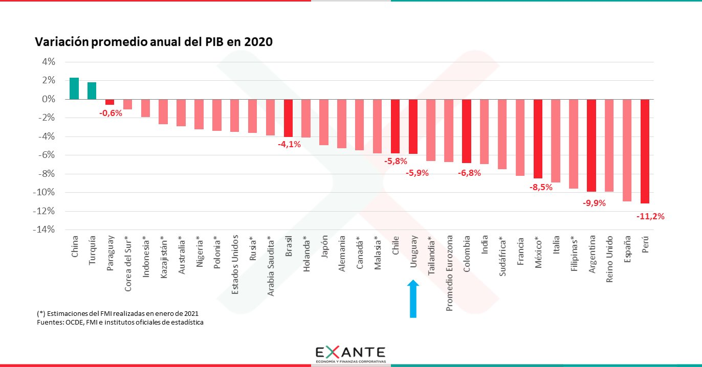
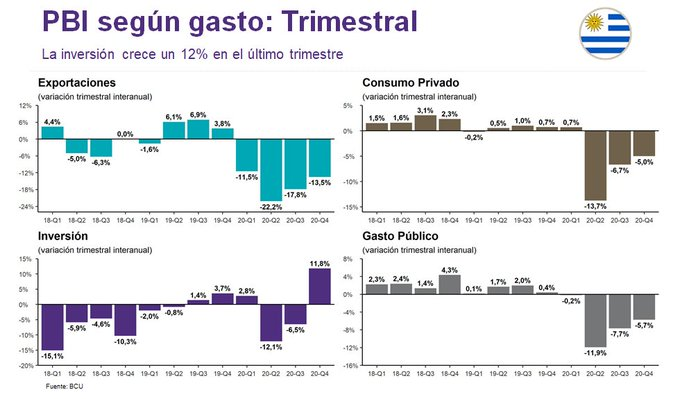
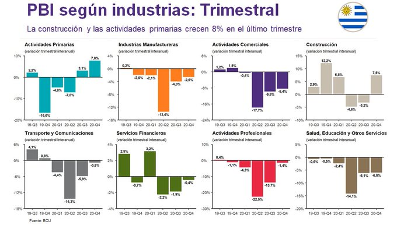
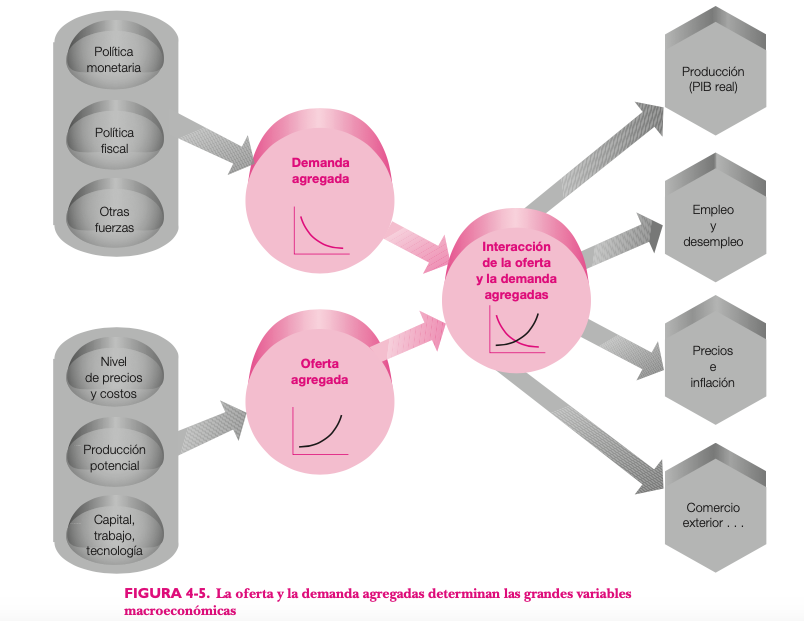
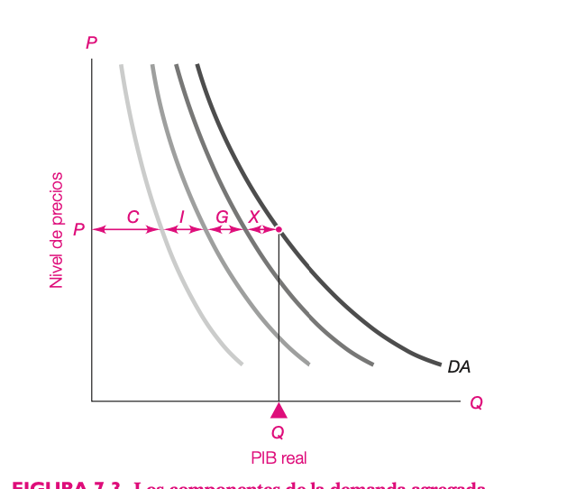
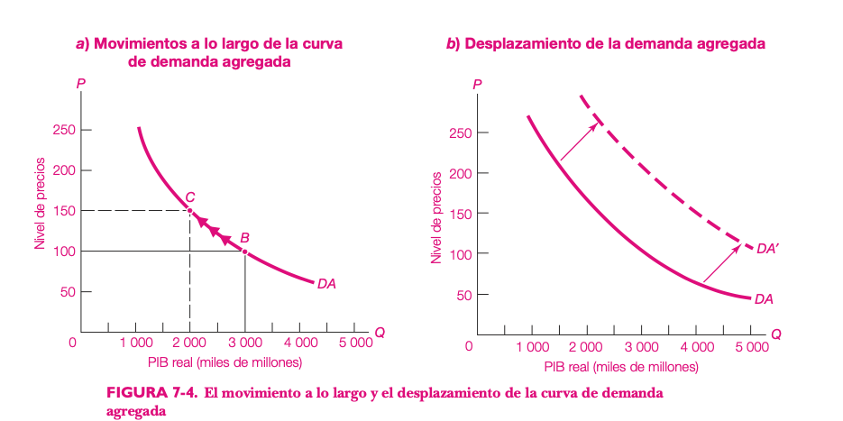
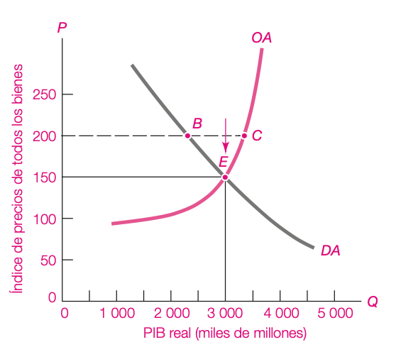
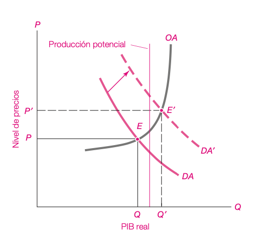

<style>

.center2 {
  margin: 0;
  position: absolute;
  top: 50%;
  left: 50%;
  -ms-transform: translate(-50%, -50%);
  transform: translate(-50%, -50%);
}

</style>

```{r setup, include=FALSE}
options(htmltools.dir.version = FALSE)
knitr::opts_chunk$set(echo = TRUE, echo = FALSE, warning = FALSE)
library(ggplot2)
library(dplyr)
library(cowplot)
library(kableExtra)


```


## PIB

Es una medida de todos los bienes y servicios _finales_ que se producen _en una región o país_ en un _período de tiempo_ valuada a _precios de mercado_.

---
## Varias formas de medir el PIB

Como el PIB se mide por un conjunto de transacciones económicas, su valor es igual si lo medimos desde el punto de vista de la demanda que de la oferta.

---

# La oferta
En este enfoque, medimos el Valor Agregado que genera cada sector de actividad de la economía (industria, agro, servicios, etc.).

$$ PIB = \Sigma\ VAB_{sectores} $$
El Valor Agregado de cada sector se define como la diferencia entre el Valor de Producción y el Consumo Intermedio (gasto en materias primas).

---

# El gasto agregado

Desde el punto de vista de la demanda, el PIB se mide como la suma de los distintos gastos de la economía

$$ PIB = C + I + G + X$$

- C es el Consumo
- I es la inversión
- G es el Gasto Público
- X son las exportaciones netas ($Exportaciones - Importaciones$)

---

Las importaciones se restan porque es una parte del gasto de la economía que termina demando productos producidos en otra economía.

Para poder medir todos los productos que produce la economía, se usa el valor monetario de la producción tomando en cuenta los precios. Si usamos los precios del período en que produjeron los bienes, tenemos el PIB _en precios corrientes_. Si queremos sacar el efecto de los cambios en los precios para comparar el PIB de dos períodos, tomamos los precios de un _año base_, para calcular el PIB en precios constantes de ese año.

---
## Los Ingresos

Como todo lo que se vende en el mercado es el ingreso de algún factor (trabajo, capital, tierra), el PIB es igual si se mide por las ventas de las empresas o por las remuneraciones a los factores.

$$ PIB = Sueldos + Beneficios + Rentas + Impuestos\ Netos + Depreciación $$

---

## El problema de la doble contabilización

¿Qué pasa con los productos que no son comprados para ser consumidos (bienes finales), sino que son comprados por otras empresas como insumos para producir otros bienes?

---
# Producto Real y Producto Potencial

- El producto real es la producción de la economía en cada año.
- El producto potencial busca eliminar el componente cíclico.

---
# Evolución Reciente en Uruguay


---


## PIB nominal vs PIB real

- Como el valor de la producción se hace a precios de mercado, el aumento en los precios hace que el PIB suba. 

- Pero si solo suben los precios, la economía no produce más.

---
<blockquote class="twitter-tweet"><p lang="en" dir="ltr">Growth in the <a href="https://twitter.com/hashtag/advancedeconomies?src=hash&amp;ref_src=twsrc%5Etfw">#advancedeconomies</a> group is projected at –5.8% in 2020, 2.3 percentage points stronger than in the June 2020 WEO Update reflecting better-than-foreseen <a href="https://twitter.com/hashtag/US?src=hash&amp;ref_src=twsrc%5Etfw">#US</a> and <a href="https://twitter.com/hashtag/euroarea?src=hash&amp;ref_src=twsrc%5Etfw">#euroarea</a> GDP growth. Read more in the <a href="https://twitter.com/hashtag/WEO?src=hash&amp;ref_src=twsrc%5Etfw">#WEO</a> <a href="https://t.co/XMCO1e58iW">https://t.co/XMCO1e58iW</a> <a href="https://t.co/eL0MkNEA0i">pic.twitter.com/eL0MkNEA0i</a></p>&mdash; IMF (@IMFNews) <a href="https://twitter.com/IMFNews/status/1316019642398175233?ref_src=twsrc%5Etfw">October 13, 2020</a></blockquote> <script async src="https://platform.twitter.com/widgets.js" charset="utf-8"></script>
---
## Algunos usos del PIB



---
## Algunos usos del PIB (2)



---
## Algunos usos del PIB (3)




---

# Preguntas 

Busca responder preguntas como:

- ¿Qué tan difícil es encontrar empleo?

- ¿Los salarios y el bienestar material de la población esta mejorando?

- ¿Qué pasa con el nivel de precios y el poder adquisitivo de los ingresos?

- ¿Cómo se comporta el tipo de cambio?

---
# Contexto histórico

.pull-left[

- John Maynard Keynes fue el que originó esta rama de la economía en los años 30s.
- Desarrolló los fundamentos teóricos de las __políticas macroeconómicas__
]

.pull-right[


]

---


## Objetivos de la política macroeconómica

- __Nivel de actividad económica__ Alto y creciente. Se mide por el PIB.
- __Nivel de precios__ Estable. La inflación tiene efectos negativos sobre la toma de decisiones y tiene un impacto regresivo en la distribución del ingreso.

- __Desempleo__ Bajo. Es un problema social e implica capacidades productivas inutilizadas. 

---

## Instrumentos de la política macroeconómica

- __Política Fiscal__ 
A través de los impuestos, el gobierno afecta los ingresos de los hogares y los precios relativos de algunos bienes (energía, cigarrillos). A través del __gasto público__ el gobierno afecta los ingresos de los hogares (transferencias) y el acceso a ciertos bienes (salud, educación, seguridad).

- __Política Monetaria__ El gobierno regula la cantidad de dinero circulante en la economía, el crédito actuando sobre las tasas de interés y regulando el sistema bancario. 

- __Inserción internacional__ El comercio internacional (exportaciones e importaciones) son clave para las economías pequeñas como Uruguay. Los instrumentos disponibles para incidir en estas variables son los aranceles y las cuotas. Además, las economías tienen relaciones financieras con el exterior. El gobierno regula estas relaciones mediante el sistema cambiario.


---
# Actividad Económica

- Las economías modernas pasan por períodos de auge y caída (fluctuaciones)

- En los períodos de auge es fácil conseguir empleo, los beneficios de las empresas son bajos y las fábricas trabajan por debajo de su capacidad.

---
# Explicaciones

- __Endógenas__: Crisis Financieras y ciclos de negocios
- __Exógenas__: Pánicos, hiperinflación, burbuja de la nueva economía, burbuja inmobiliaria, pandemias.


---
# El modelo de Oferta y Demanda Agregadas

- Es una teoría que busca explicar los ciclos de la economía.

---



---


---
# La Oferta Agregada

- Tiene pendiente positiva en el plano $(Y, P)$
- Cambia cuando cambian los factores de producción o la tecnología de la economía.


---
# Demanda Agregada

- Es el output total de la economía que es demandado para cada nivel de precios.
- Tiene 4 componentes: consumo, inversión, gasto público y exportaciones netas.
  
$$ DA = C + I + G + NX $$
---
# Consumo

Es el gasto de los hogares en bienes como alimentos y servicios como la educación y la salud.

- Dependen __positivamente__ del nivel de ingresos __reales__.
- Dependen __negativamente__ del nivel de impuestos al consumo.

---
# Inversión

Es el gasto que hacen las empresas en bienes que aumentan la producción en el futuro (equipos, edificios, etc.)
- Dependen de las condiciones crediticias (tasas de interés para financiarse)
- Dependen de las expectativas de los empresarios.
- Dependen del nivel de impuestos a la inversión.

---
# Gasto Público

Es el gasto que hace el gobierno para proveer servicios públicos (seguridad, educación, salud) y las transferencias (jubilaciones, seguridad social).
- Es una variable que define el gobierno.

---
# Exportaciones netas

Es el gasto que hacen los extranjeros en nuestra economía (exportaciones) __menos__ el gasto que hacen los residentes en economías extranjeras (importaciones).

- Dependen del nivel de precios relativos de la economía doméstica con el resto del mundo.
- Depende del Tipo de Cambio (valor del dólar). Si el dólar sube, aumentan las exportaciones y caen las importaciones.
- Depende del nivel de ingresos de los países a los que exportamos (si hay una crisis en un país al que exportamos mucho nuestras exportaciones caen).

  
---


  
---
# Demanda Agregada

- Tiene pendiente negativa.
- Esto se debe a que si sube el nivel de precios, los ingresos __reales__ caen.
- Además, si suben los precios domésticos, las exportaciones bajan y las importaciones suben.
- Cuidado con la diferencia entre los desplazamientos __sobre__ la DA y __de__ la DA.

---


---
# Cambios en la DA

- Variables de política
  - Política Monetaria
  - Política Fiscal
  
- Variables exógenas
  - Ingreso internacional
  - Activos
  - Tecnología
  - Otros


---
# Equilibrio Macroeconómico


---

# Shock en la demanda




<!-- ## Movimientos de la DA vs. Movimientos sobre la DA -->

<!-- ```{r eval = FALSE} -->

<!-- punto_a <- slice(demand, 70) -->
<!-- punto_b <- slice(demand, 30) -->

<!-- p1 <- ggplot(demand, aes(x = x, y = y)) +  -->
<!--   geom_path(color = "#0073D9", size = 1) +  -->
<!--   geom_point(data = punto_a) +  -->
<!--   geom_segment(x=0, y=punto_a$y, xend=punto_a$x, yend=punto_a$y, linetype = "dashed") +  -->
<!--   geom_segment(x=punto_a$x, y=0, xend=punto_a$x, yend = punto_a$y, linetype = "dashed") + -->
<!--   geom_point(data = punto_b) +  -->
<!--   geom_segment(x=0, y=punto_b$y, xend=punto_b$x, yend=punto_b$y, linetype = "dashed") +  -->
<!--   geom_segment(x=punto_b$x, y=0, xend=punto_b$x, yend = punto_b$y, linetype = "dashed") + -->
<!--   geom_segment(data = slice(demand, seq(70, 30, by=-10)),  -->
<!--                aes(xend=lag(x), yend=lag(y)), -->
<!--                color = "red", -->
<!--             arrow = arrow(type = "open", angle = 30, length = unit(0.1, "inches"))) +  -->
<!--   scale_y_continuous(lim = c(0, 11), expand = c(0, 0)) +   -->
<!--   coord_equal() + -->
<!--   labs(title = "Movimiento sobre la curva") -->

<!-- ``` -->

<!-- ```{r} -->
<!-- p2 <- ggplot(demand, aes(x = x)) +  -->
<!--   geom_path(aes(y=y), color = "#0073D9", size = 1) +  -->
<!--   geom_path(aes(y=y+2), color = "#0073D9", size = 1, linetype = "dashed") +  -->
<!--   geom_segment(x=2, xend=2.5, y=7, yend=7.5, size = 0.2,  -->
<!--                arrow=arrow(type = "open", angle = 30, length = unit(0.1, "inches"))) + -->
<!--   geom_segment(x=4.6, xend=5.2, y=4, yend=4.7, size = 0.2,  -->
<!--                arrow=arrow(type = "open", angle = 30, length = unit(0.1, "inches"))) + -->
<!--   scale_y_continuous(lim = c(0, 11), expand = c(0, 0)) +   -->
<!--   coord_equal() + -->
<!--   labs(title = "Movimiento de la curva") -->

<!-- ``` -->

<!-- .center2[ -->
<!-- ```{r} -->
<!-- plot_grid(p1, p2) -->
<!-- ``` -->
<!-- ] -->


<!-- --- -->
<!-- # Caída en la demanda agregada -->

<!-- ```{r} -->
<!-- demand <- function(q) (q - 10)^2 -->
<!-- demand_2 <- function(q) (q - 10)^2 + 40 -->
<!-- supply <- function(q) q^2 + 2*q + 8 -->

<!-- x <- 0:10 -->


<!-- q_1 <- uniroot(function(x) demand(x) - supply(x), range(x))$root -->
<!-- q_2 <- uniroot(function(x) demand_2(x) - supply(x), range(x))$root -->


<!-- p_1 <- supply(q_1) -->
<!-- p_2 <- supply(q_2) -->

<!-- chart <- ggplot() + -->
<!--   stat_function(aes(x, color = "Demand_2"),  -->
<!--                 xlim = c(1.5, 8), -->
<!--                 fun = demand, linetype = "dashed") + -->
<!--   stat_function(aes(x, color = "Demand_1"),  -->
<!--                 xlim = c(1.5, 8), -->
<!--                 fun = demand_2) + -->
<!--   stat_function(aes(x, color = "Supply"), fun = supply) + -->
<!--   labs(title = "Caída en la DA", -->
<!--     caption = "Una caída de la demanda agregada reduce el PIB y el nivel de precios",  -->
<!--     y="P", x="Q") -->

<!-- caida <- chart + -->
<!--   annotate("point", x = q_1, y = p_1) + # Refactor to use another data set? -->
<!--   annotate("point", x = q_2, y = p_2) + # geom_point, geom_step, geom_text_repel -->
<!--   annotate("segment", x=0, y=p_1, xend=q_1, yend=p_1, linetype = "dashed") +  -->
<!--   annotate("segment", x=q_1, y=p_1, xend=q_1, yend=0, linetype = "dashed") +  -->
<!--   annotate("segment", x=0, y=p_2, xend=q_2, yend=p_2, linetype = "dashed") +  -->
<!--   annotate("segment", x=q_2, y=p_2, xend=q_2, yend=0, linetype = "dashed") +  -->
<!--   scale_x_continuous(breaks = c(q_1, q_2), labels = expression(Q[1], Q[2]), -->
<!--                      expand = expand_scale(add = c(0, 2), -->
<!--                                            mult = c(0, 0))) + -->
<!--   scale_y_continuous(breaks = c(p_1, p_2),  -->
<!--                      labels = expression(P[1], P[2]), -->
<!--                      limits = c(0, 101), -->
<!--                      expand = c(0, 0)) + -->
<!--   geom_segment(aes(color = "Qd", x = 10, xend = 10, y=0, yend = 100), size = 1) + # Add manual legend -->
<!--   theme( -->
<!--     axis.title.y = element_text(angle = 0, vjust = 1) , -->
<!--     axis.title.x = element_text(hjust = 1, vjust = 6) -->
<!--   ) -->

<!-- caida -->
<!-- ``` -->


<!-- --- -->
<!-- ## El modelo del multiplicador -->


<!-- Ejemplo numérico -->

<!-- ```{r} -->
<!-- df <- tibble( -->
<!--   GDP = seq(4200, 2700, by=-300), -->
<!--   Consumo = seq(3800, 2800, by = -200), -->
<!--   S = GDP-Consumo, -->
<!--   I = 200 -->
<!-- ) -->

<!-- knitr::kable(df) %>%  -->
<!--   kable_styling() -->

<!-- ``` -->

<!-- $$ C = 1000 + \frac{2}{3} GDP $$ -->


<!-- --- -->
<!-- ## Gráficamente: Equilibrio -->

<!-- ```{r} -->
<!-- # Fig. 22-7 -->
<!-- base_multiplicador <- df %>%  -->
<!--   ggplot() +  -->
<!--   geom_line(aes(GDP, Consumo+I)) + -->
<!--   geom_abline(slope = 1, intercept = 0) +  -->
<!--   scale_x_continuous(expand = c(0, 0)) +  -->
<!--   scale_y_continuous(expand = c(0, 0), breaks = df$GDP) + -->
<!--   coord_equal() +  -->
<!--   labs(x = "GDP", y="Gasto Agregado") -->

<!-- ``` -->


<!-- ```{r} -->
<!-- equilibrio <- filter(df, GDP == Consumo + I) -->

<!-- graf_equilibrio <- base_multiplicador +  -->
<!--   #geom_line(aes(GDP, Consumo), linetype = "dashed") +  -->
<!--   geom_point(aes(x=GDP, y=Consumo+I), data = equilibrio) + -->
<!--   geom_segment(aes(x=2700, y=equilibrio$GDP, xend=equilibrio$GDP, yend = equilibrio$GDP)) + -->
<!--   geom_segment(aes(x=equilibrio$GDP, y=equilibrio$GDP, xend=equilibrio$GDP, yend = 2750)) -->
<!-- graf_equilibrio -->


<!-- ``` -->

<!-- --- -->
<!-- ## Ajustes fuera del equilibrio -->

<!-- ```{r, fig.width = 10, fig.height=10} -->
<!-- g1 <- base_multiplicador +  -->
<!--   labs(title = "Ingreso < DA") -->

<!-- g2 <- base_multiplicador +  -->
<!--   labs(title = "Ingreso > DA") -->

<!-- plot_grid(g1, g2) -->
<!-- ``` -->


<!-- --- -->
<!-- ## Aumento del gasto exógeno -->

<!-- ```{r} -->
<!-- graf_equilibrio +  -->
<!--  geom_line(aes(GDP, Consumo), color ="red") + -->
<!--  geom_segment(aes(x=3900, y=3650, xend=3900, yend=3750), arrow=arrow(length=unit(0.20,"cm"))) + -->
<!--  geom_segment(aes(x=3000, y=3050, xend=3000, yend=3150), arrow=arrow(length=unit(0.20,"cm"))) -->
<!-- ``` -->

<!-- --- -->
<!-- ## Aumento del gasto exógeno (2) -->

<!-- El efecto multiplicador -->


